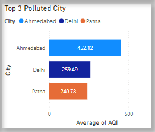
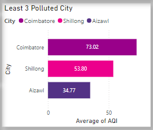
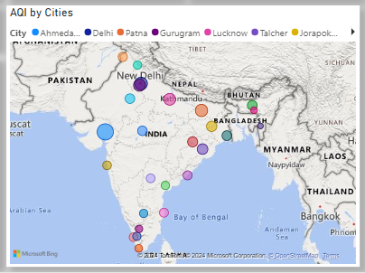
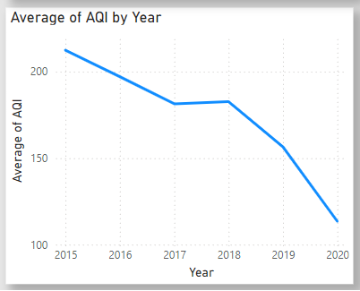

# Air Quality Index (AQI) Analysis Project

### Project Overview
This Power BI project provides an in-depth analysis of the Air Quality Index (AQI) across multiple cities in India. The purpose of this project is to visualize key air pollutants over time, compare AQI levels across cities, and highlight trends in pollutant concentration to gain insight into pollution patterns. This analysis can aid environmental agencies, policymakers, and researchers in tracking air quality changes and identifying areas with critical pollution levels.

### Data Source
The AQI dataset was obtained from Kaggle, containing daily air quality measurements across various Indian cities. In preprocessing:
- **Null values** were removed to ensure accurate analysis.
- The **first row was converted into headers** for easier data manipulation.

### Features
This report includes the following analyses and visuals:
- **Average Pollutants**: Displays average levels of critical pollutants (CO, SO₂, NO, PM2.5) across cities.
- **Top and Least Polluted Cities**: A stacked bar chart highlights the top 3 and least polluted cities based on AQI.
- **AQI by City (Map Visualization)**: A map visual displays AQI by city, enabling geographic comparison of air quality levels.
- **Average AQI by Year**: A line chart showing the average AQI trend by year, illustrating changes in air quality over time.
- **Last Refresh Date**: Displays the most recent data refresh date to ensure the report is up-to-date.

### Usage Instructions
To explore this report:
1. Download the `AQI.pbix` file from this repository.
2. Open Power BI Desktop and load the file.
3. Interact with the visuals to explore different AQI metrics and insights.

### Screenshots

*Screenshots provide a glimpse of the visuals available within the report.*

---

### Additional Details

- **Insights**: Through these visuals, users can understand how specific pollutants contribute to AQI and identify pollution hotspots across cities and over time.
- **Power BI Interactivity**: The report’s interactive elements allow users to filter by pollutant type, city, and year to gain targeted insights.

